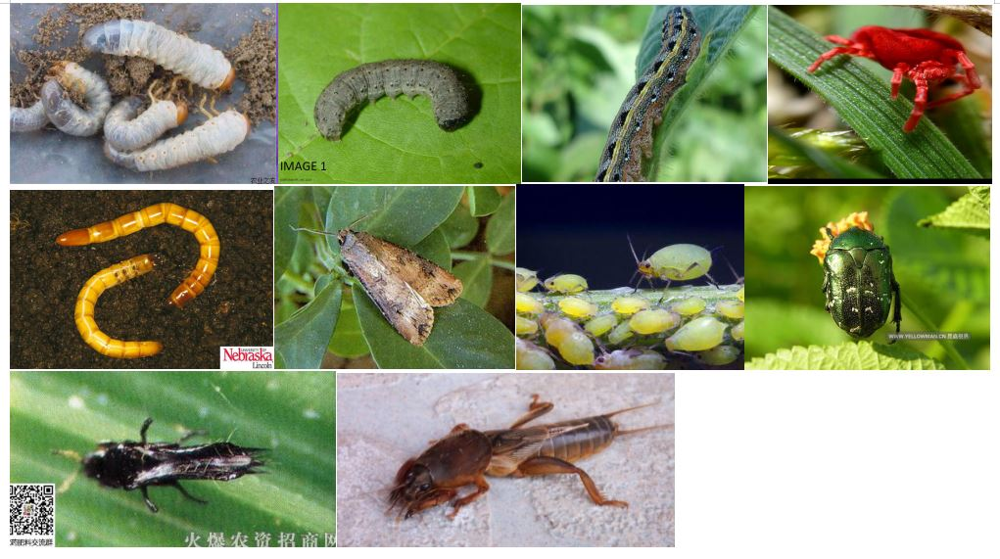
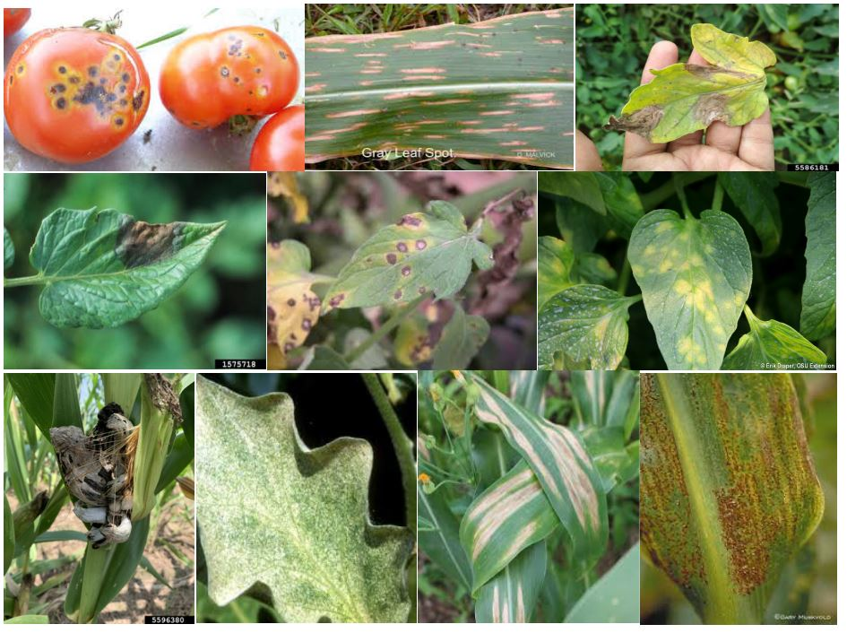
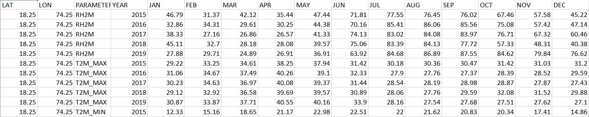
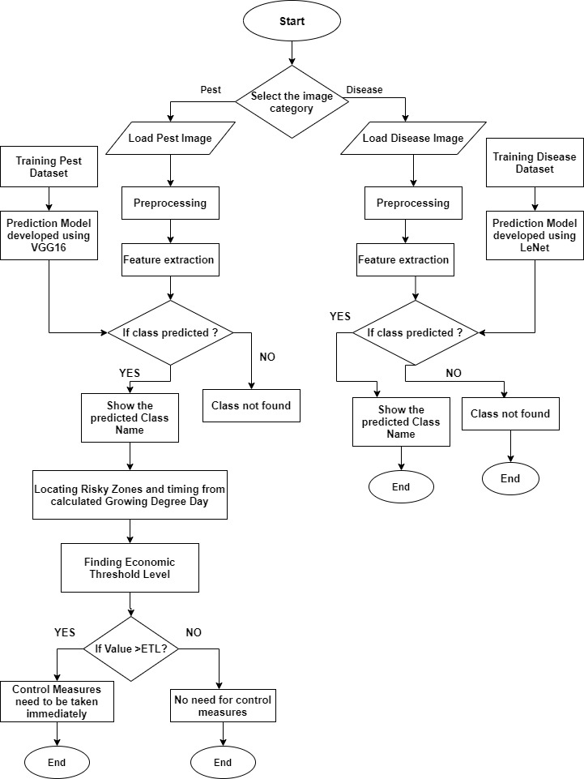

### Dataset
There are two types of data set required in this project: 
*     Pest data set
*     Disease Data set. 
The data set is split in 9: 1 ratio of train and validation set.

This data set consist of 4709 images for training and 486 images for validation of 10 pest species images with complex and varied background.

This data set consist of original 4463 images for training and 460 for validation of 10 diseases of corn and tomato from PlantDoc data set and IPM image website.

This is the Maximum and Minimum temperature dataset which is used for calculation of growing degree day. This weather data is collected for monthwise for all districts of Maharashtra from 2018 to June 2020.

### Flowchart

