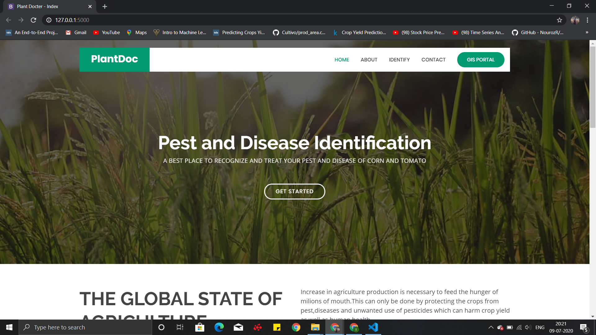
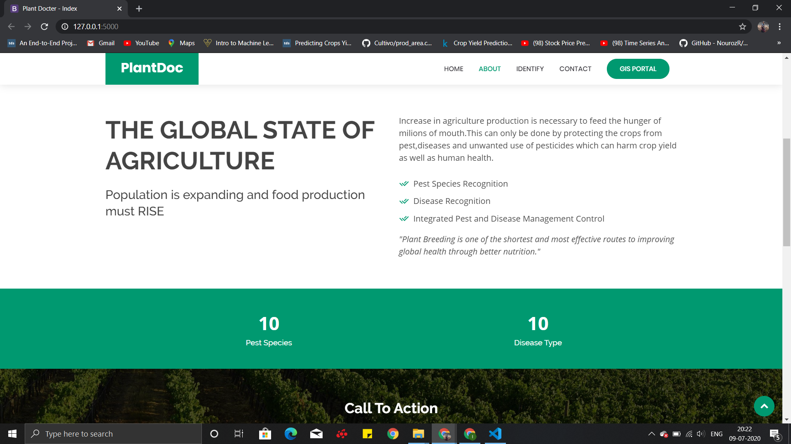
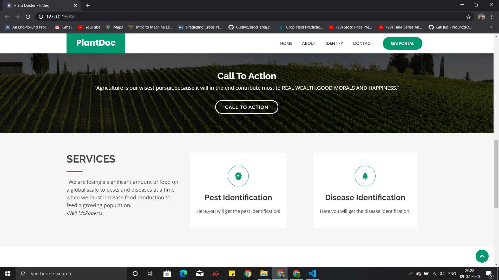
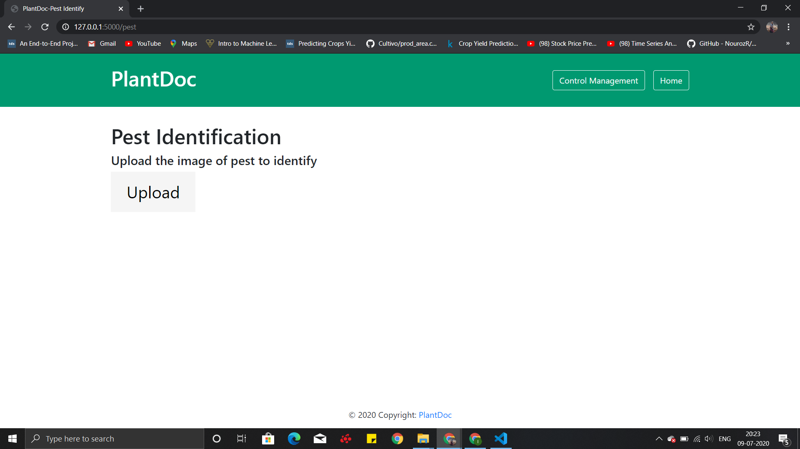
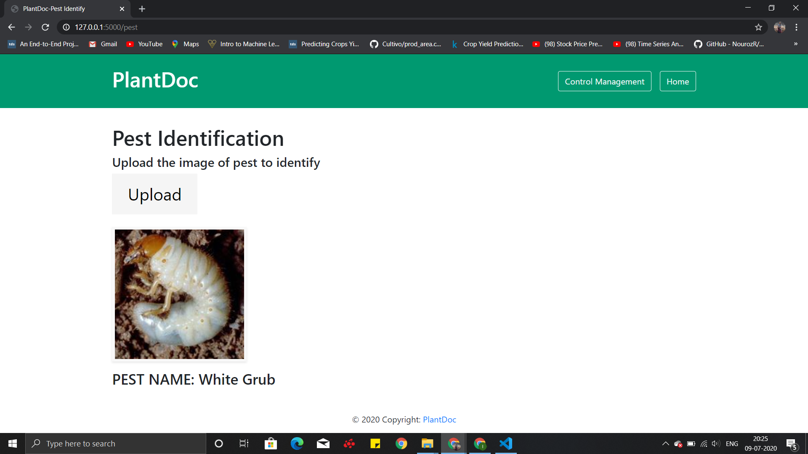
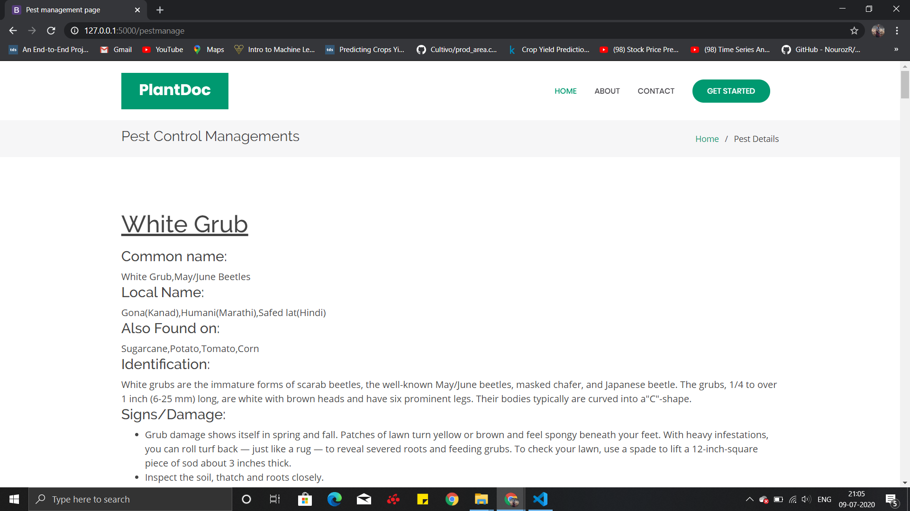
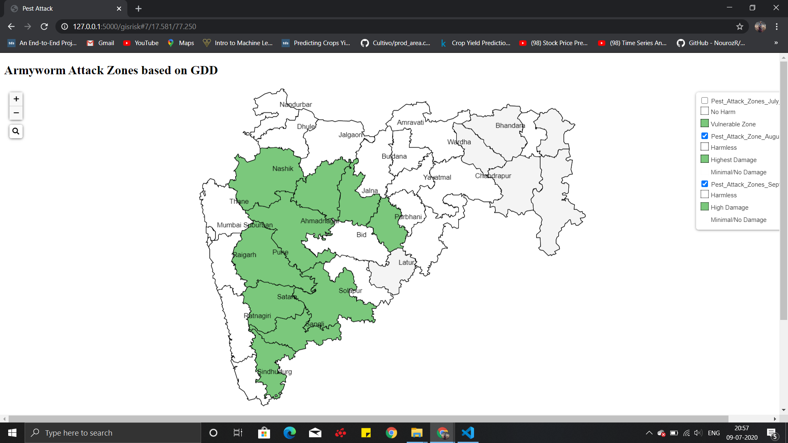
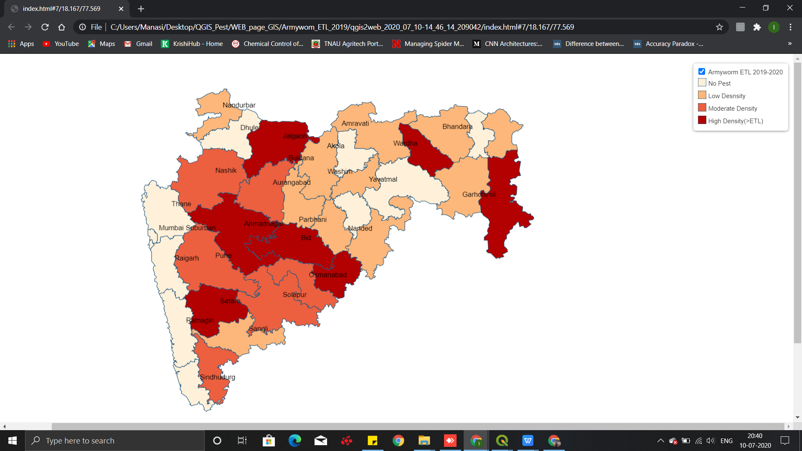

### Description
Detection of pest and diseases is done using neural network. A weather-based  indicator called growing Degree Day is used to estimating heat accumulation used to foresee plant and pest development rates for scheduling pest scouting. Economic Injury Level and Economic Threshold can be used to regulate whether any action or pest management tactic is required to lessen the damage related with this pest.
### Installations

* **Python 3.7** : This is required for basic coding of Neural Network methods and for Flask framework. 

* **Bootstrap v3.4.1** : This is for creating front end of the website. 
 
* **Flask 1.1.2** : This is WSGI(Web server Gateway Inteface) web application framework for machine learning and deep neural network.

* **QGIS 3.10.5** : This is required for GIS Mapping of ETL and GDD.

* **Google Colab** : This is required for performing Convolutional neural network methods like VGG16 and LeNet. Here, the dataset is trained and can be validated.

### Libraries

##### numpy 1.18.4
    pip install numpy

##### scikit-learn 0.20.0

    pip install -U scikit-learn

##### keras 2.2.5

    pip install keras

##### tensorflow 1.14.0

    pip install tensorflow==1.14.0

##### matplotlib 3.0.0

    pip install matplotlib

##### Pillow 7.1.2

    pip install pillow

##### cv2

    pip install opencv-python

##### Flask 1.1.2

For installation of flask you need to follow three steps as follow:

#### Create a virtual environment

###### Create a project folder
    mkdir myproject

###### Create venv folder within project folder.

    cd myproject
    python3 -m venv venv

##### Activate the virtual environment

###### Activate the corresponding environment.
    venv\Scripts\activate
After this, your shell prompt will change to show the name of the activated environment.
Within the activated environment, use following command for installation of flask.
#### Install Flask
     pip install flask

#### gevent 20.5.0
    pip install gevent

#### werkzeug 1.0.1
    pip install werkzeug

### Conclusion

**Prediction of Armyworm Vulnerable regions in Maharashtra State**

**Prediction of Armyworm Severity regions in Maharashtra State**

### Detail Documentation Link
[Detail Documentation](Document.md)